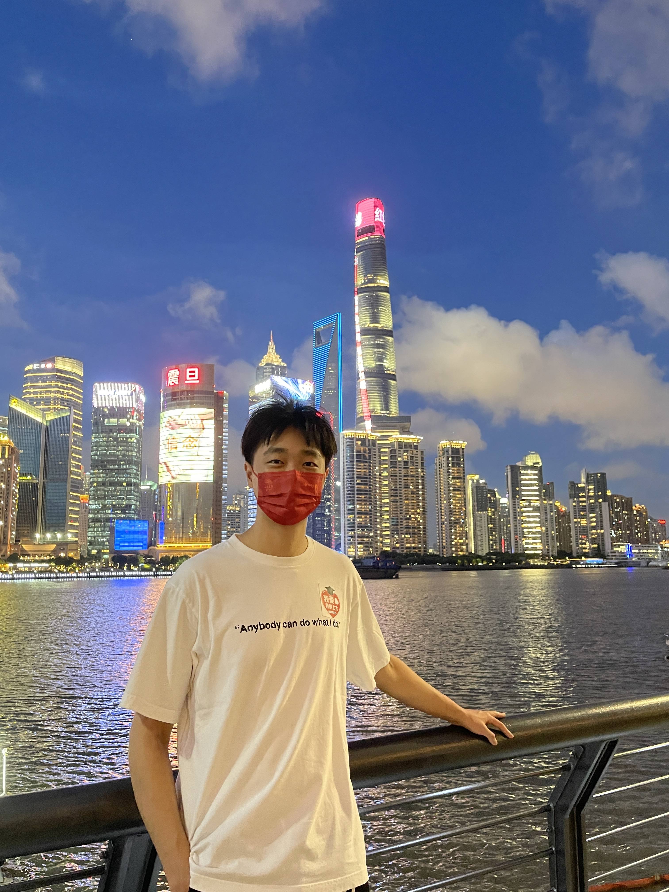

* Hi there! I am SHEN Jiyuan, a MEng student in the [Strategic Centre for Research in Privacy-Preserving Technologies & Systems (SCRIPTS)](https://www.ntu.edu.sg/scripts/home) at [Nanyang Technological University, Singapore](https://www.ntu.edu.sg/index), advised by Prof. [LAM, Kwok Yan](https://personal.ntu.edu.sg/kwokyan.lam/). (see my [[Resume]()], and [[Google Scholar]()].)
* My primary research interest in Deep Learning and Computer Vision tasks. I did some computer vision related projects during my undergraduate and intern in [Bosch Corporate Research](https://www.bosch.com/). And, I will study the privacy protect technology during my master in SG. To be frank, I’m still finding the specific topic that I like and I will update as soon as I have my decision.
* I received my Bachelor’s Degree from [Shanghai University, China](https://www.shu.edu.cn/) with a major in Intelligent Science and Technology (Department of Computer Science and Engineering). My undergraduate research advisor was Prof. [Xing Wu](https://scholar.google.com/citations?user=rRQ_BQIAAAAJ&hl=en).

# Recent News
* July 5, 2022. I successfully graduated from Shanghai University and won the honorary title of outstanding graduates.
