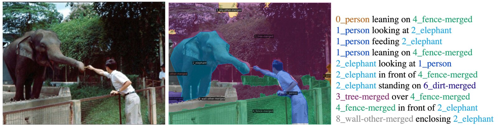
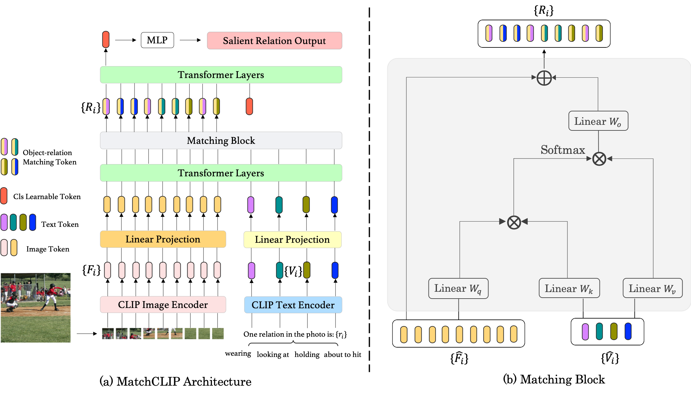
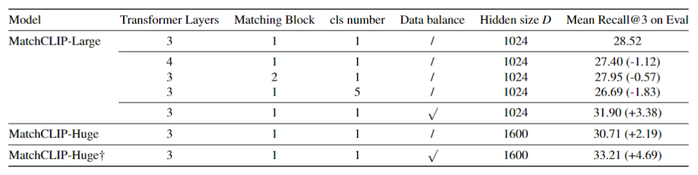
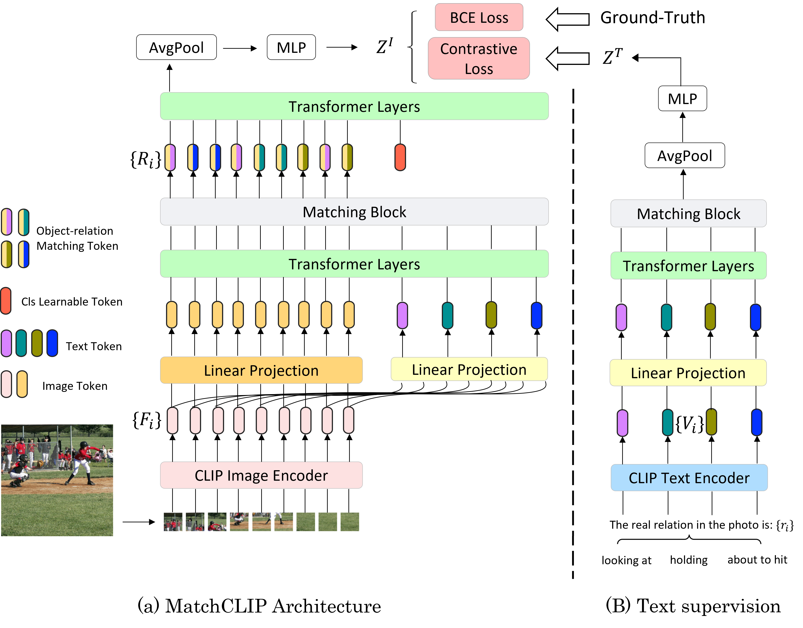

This is the personal project of CE7454 (Deep Learning for Data Science): Panoptic Scene Graph Classification.



---

# MatchCLIP: Viewing Object-Relation Classification As A Matching Problem

## What PSG Classification
Nowadays, most of the current computer vision tasks focus on the objects in the image. For example, image classification requires models to identify the object classes in the image. Object detection and image segmentation further require the model to identify objects in the image and find their locations (with different granularities). However, it seems that so many tasks ignore the semantic property like relation between objects inside the images. Therefore, in this assignment, the PSG Classification Challenge bridges this gap and requires us to explore how to train a computer vision model to well identify the relations in the images.

To be more specific, PSG Classification Challenge needs to establish a model that can output three most salient relations in the picture. It actually decreases the difficulty from pixel-level relation classification to image-level one. For example, in above picture, when the model sees the photo, rather than providing the information of the objects (e.g. person, elephant), it only needs to output three salient relations such as feeding, leaning-on, and looking-at.

## Proposed Method

To solve this problem, a naive idea is treating it directly as a classification task. However, it definitely cannot work well (approximate at about 15.49\% mean recall@3) because the objects relationship is not apparent and direct like objects categories at all. Some other existing methods like CLIP series can model the object relationship to some extent despite that they are not designed to fulfill that characteristic straight-forward, in fact, their models are still not explicitly constructed objects relationship. CLIP implicitly learn about the relationship inside the images with the help of the large-scale datasets and contrastive Language-Image pre-training via natural language supervision. Although we can simply modify these models by fine-tuning only the last fully connected layer and freezing the former layers in order to predict the object relationships, the *cls* token cannot work well and make a good prediction (approximate at about 23.03\% mean recall@3). The reasons are: 1) the relationship is implicit and output it from a object-based model is still too difficult; 2) the attention module only connect with different levels of feature maps, not directly with the relation tokens. However, the CLIP model is still attractive and powerful. If use the CLIP model as a feature extraction and then explicitly embed the relations into these, we possibly can make fully use of the CLIP's strong power. Additionally, due to that the relationship is always based on two distinct objects, it can be viewed as a matching problem. In other words, one object can query its most corresponding relationship automatically with the help of explicitly encoding the relation tokens.

As a result, I propose a network called MatchCLIP inspired from GroupViT and modify it to adapt the PSG Classification task. The proposed method is easy to implement and do not need much modifications from the naive ViT\cite{dosovitskiy2020image}. The main contributions in this project include:

- Use CLIP as an image feature extraction and propose a prompt engineering to assist the model converge.

- View object-relation classification as a matching problem and propose a Transformer-based model called MatchCLIP to explicitly query the relationship between different objects.

- Do a detailed ablation experiments and find the optimal training settings and hyper parameters. Achieve 34.60\% mean recall@3 on the PSG classification competition leaderboard.

## Abalation Experiments

## Rethink & Further Improvement

Although it achieves a pretty nice score of 34.60\% mean recall@3 on the PSG classification competition leaderboard, it still meets some problems. 
1) The prompt of CLIP text input is fixed and limited. 
2) The output is still a batch of probability and doesn't contain any reality information, which limits MatchCLIP's performance.

I have some ideas about how to deal with the above two points and attach my improved architecture following.

---

Code is [here](https://github.com/shenjiyuan123/CE7454_PSG).

Full paper is [here](https://github.com/shenjiyuan123/CE7454_PSG/blob/main/CE7454_PSG%20(3).pdf).

