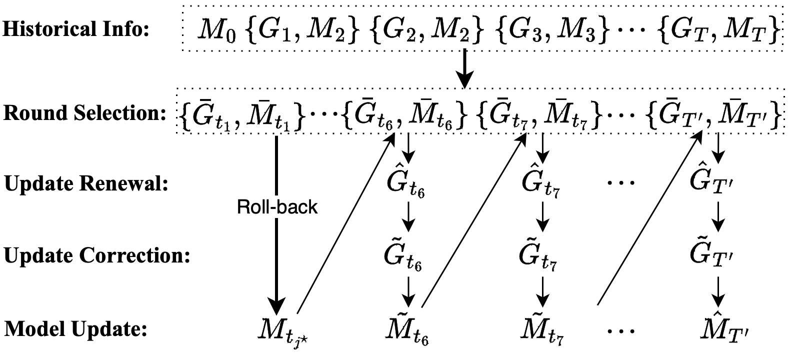

## Abstract

Federated learning (FL) is vulnerable to poisoning attacks, where malicious clients manipulate their updates to affect the global model.
Although various methods exist for detecting those clients in FL, identifying malicious clients requires sufficient model updates, and hence by the time malicious clients are detected, FL models have been already poisoned. Thus, a method is needed to recover an accurate global model after malicious clients are identified. Current recovery methods rely on (i) all historical information from participating FL clients and (ii) the initial model unaffected by the malicious clients, leading to a high demand for storage and computational resources.
% Therefore, efficiently and effectively recovering poisoned models remains a considerable challenge.

In this paper, we show that highly effective recovery can still be achieved based on (i) selective historical information rather than all historical information and (ii) a historical model that has not been significantly affected by malicious clients rather than the initial model. In this scenario, while maintaining comparable recovery performance, we can accelerate the recovery speed and decrease memory consumption. Following this concept, we introduce Crab, an efficient and certified recovery method, which relies on selective information storage and adaptive model rollback. Theoretically, we demonstrate that the difference between the global model recovered by Crab and the one recovered by train-from-scratch can be bounded under certain assumptions. Our empirical evaluation, conducted across three datasets over multiple machine learning models, and a variety of untargeted and targeted poisoning attacks reveals that Crab is both accurate and efficient, and consistently outperforms previous approaches in terms of both recovery speed and memory consumption.

[Download paper here](https://arxiv.org/abs/2401.08216)

[code](https://github.com/shenjiyuan123/Adaptive_Recovery)