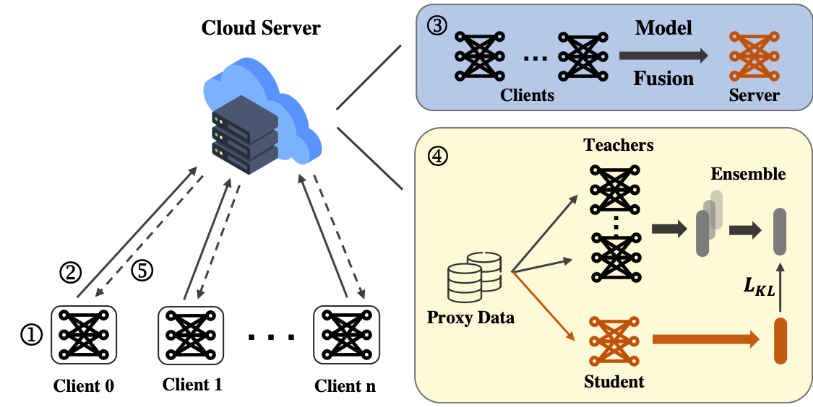

## Abstract

With the rapid development of low-cost consumer electronics and cloud computing, Internet-of-Things (IoT) devices are widely adopted for supporting next-generation distributed systems such as smart cities and industrial control systems. IoT devices are often susceptible to cyber attacks due to their open deployment environment and limited computing capabilities for stringent security controls. Hence, Intrusion Detection Systems (IDS) have emerged as one of the effective ways of securing IoT networks by monitoring and detecting abnormal activities. However, existing IDS approaches rely on centralized servers to generate behaviour profiles and detect anomalies, causing high response time and large operational costs due to communication overhead. Besides, sharing of behaviour data in an open and distributed IoT network environment may violate on-device privacy requirements. Additionally, various IoT devices tend to capture heterogeneous data, which complicates the training of behaviour models. In this paper, we introduce Federated Learning (FL) to collaboratively train a decentralized shared model of IDS, without exposing training data to others. Furthermore, we propose an effective method called Federated Learning Ensemble Knowledge Distillation (FLEKD) to mitigate the heterogeneity problems across various clients. FLEKD enables a more flexible aggregation method than conventional model fusion techniques. Experiment results on the public dataset CICIDS2019 demonstrate that the proposed approach outperforms local training and traditional FL in terms of both speed and performance and significantly improves the system's ability to detect unknown attacks. Finally, we evaluate our proposed framework's performance in three potential real-world scenarios and show FLEKD has a clear advantage in experimental results.

[Download paper here](http://shenjiyuan123.github.io/files/FLEKD.pdf)

[Code](https://github.com/shenjiyuan123/AST-Alignment-with-Smooth-Expert)