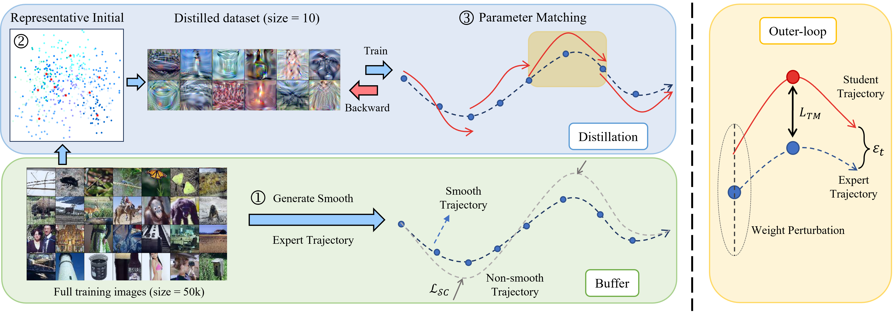

## Abstract

Training large AI models typically requires large-scale datasets in the machine learning process, making training and parameter-tuning process both time-consuming and costly. Some researchers address this problem by carefully synthesizing a very small number of highly representative and informative samples from real-world datasets. This approach, known as Dataset Distillation (DD), proposes a perspective for data-efficient learning. Despite recent progress in this field, the performance of existing methods still cannot meet expectations, and distilled datasets cannot effectively replace original datasets. In this paper, unlike previous methods that focus solely on improving the effectiveness of student distillation, we recognize and leverage the important mutual influence between expert and student models. We observed that the smoothness of expert trajectories has a significant impact on subsequent student parameter alignment. Based on this, we propose an effective DD framework named AST, standing for Alignment with Smooth and high-quality expert Trajectories. We devise the integration of clipping loss and gradient penalty to regulate the rate of parameter changes in expert trajectory generation. To further refine the student parameter alignment with expert trajectory, we put forward representative initialization for the synthetic dataset and balanced inner-loop loss in response to the sensitivity exhibited towards randomly initialized variables during distillation. We also propose two enhancement strategies, namely intermediate matching loss and weight perturbation, to mitigate the potential occurrence of cumulative errors. We conduct extensive experiments on datasets of different scales, sizes, and resolutions. The results demonstrate that the proposed method significantly outperforms prior methods.

[Download paper here](https://arxiv.org/abs/2310.10541)

[Code](https://github.com/shenjiyuan123/AST-Alignment-with-Smooth-Expert)